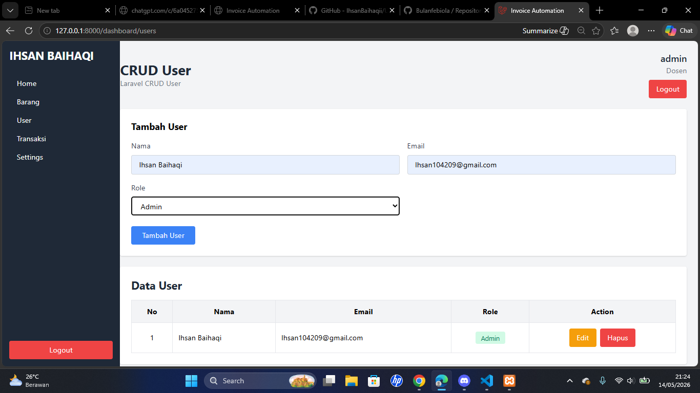
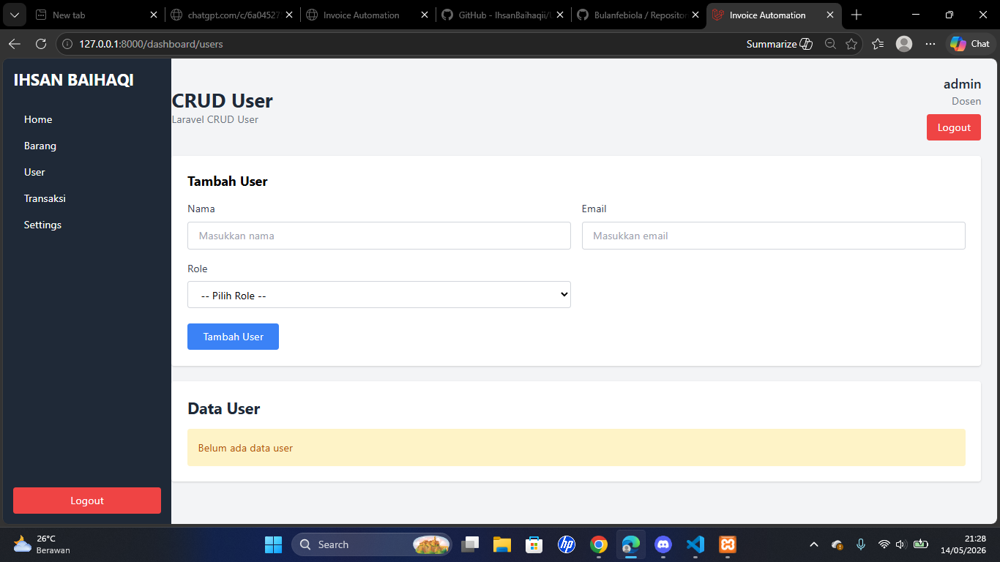
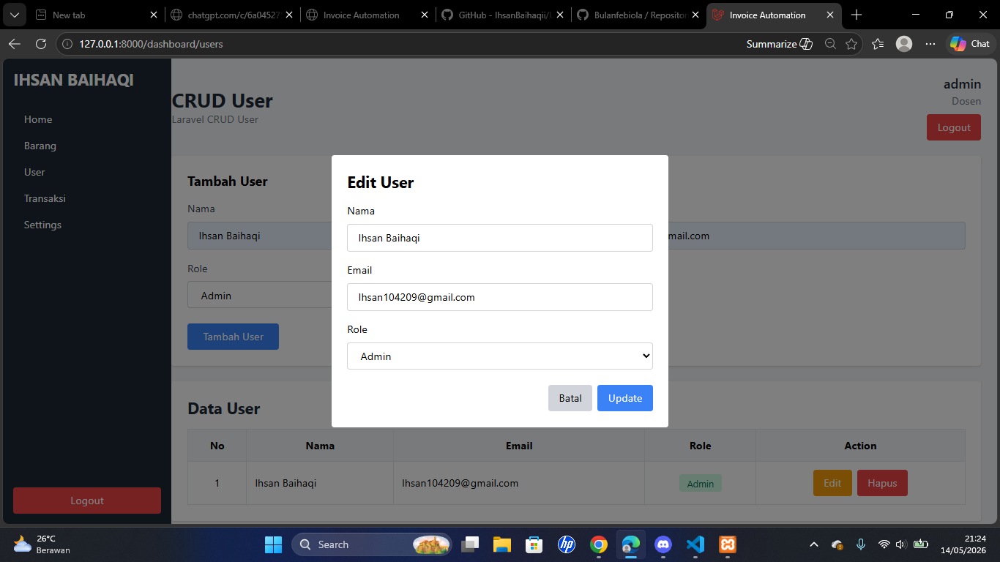
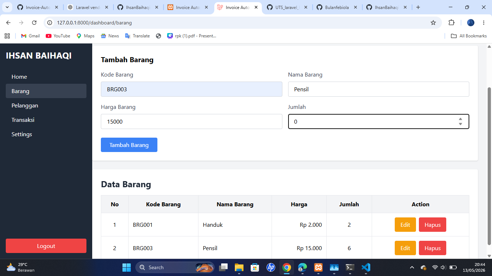
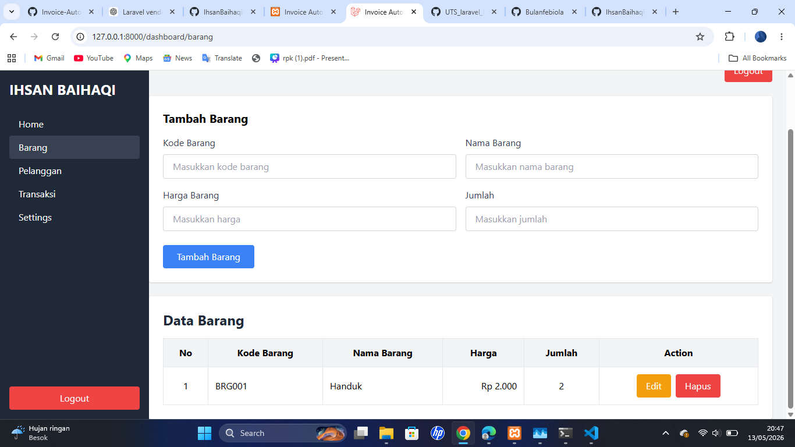

# TUGAS UTS - CRUD Laravel

## Informasi Mahasiswa

| Keterangan | Detail                                            |
| ---------- | ------------------------------------------------- |
| Nama       | [Ihsan Baihaqi](https://ihsanbaihaqii.vercel.app) |
| Kelas      | 24M11                                             |
| NIM        | 24012217                                          |

---

## Deskripsi Project

Project ini merupakan tugas UTS berbasis  
PHP dan Laravel yang berisi fitur CRUD:

- CRUD Users
- CRUD Barang
- Login & Logout
- Session Authentication
- Dashboard Admin

---

## Teknologi Yang Digunakan

- PHP
- Laravel
- Tailwind CSS
- MySQL

---

## Fitur

- Login
- Logout

### CRUD Users

- Tambah user
- Edit user
- Hapus user
- Role user & admin

### CRUD Barang

- Tambah barang
- Edit barang
- Hapus barang

---

## Tampilan Project

[Lihat Semua Screenshot](/screenshoot/)

## CRUD Users

### Create User



### Delete User



### Edit User



---

## CRUD Barang

### Create Barang



### Edit Barang


### Delete Barang



---

## Cara Menjalankan Project

### Clone Repository

```bash
git clone https://github.com/IhsanBaihaqii/UTS_Ihsan-baihaqi_Laravel.git
```

### Masuk Ke Folder Project

```bash
cd UTS_Ihsan-baihaqi_Laravel
```

### Install Dependency

```bash
composer install
```

### Copy File ENV

```bash
cp .env.example .env
```

### Generate Key

```bash
php artisan key:generate
```

### Migration Database

```bash
php artisan migrate
```

### Jalankan Laravel

```bash
php artisan serve
```

---

## Author

[Ihsan Baihaqi](https://ihsanbaihaqii.vercel.app)
